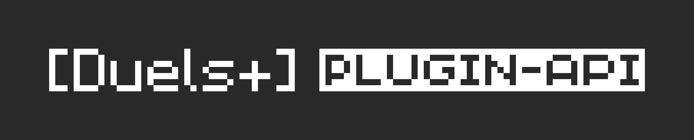

<p align="center">
  <a href="https://www.npmjs.com/package/@duelsplus/plugin-api"></a>
  <a href="LICENSE"></a>
</p>

Official Plugin API for the **Duels+ Proxy**. Use this package to build plugins that run inside the proxy.

## Installation
```bash
npm install @duelsplus/plugin-api
# or
bun add @duelsplus/plugin-api
```
## Quick Start

```ts
import { Plugin, PluginContext } from '@duelsplus/plugin-api';

export default class MyPlugin extends Plugin {
  id = 'my-plugin';
  name = 'My Plugin';

  onLoad(ctx: PluginContext) {
    ctx.events.on('game:start', () => {
      ctx.client.sendChat('§aGame started!');
    });
  }
}
```

Plugins live in `~/.duelsplus/plugins/<your-plugin>/`. The proxy loads them at startup and provides the runtime; you use this package for types and the `Plugin` base class.

## Examples
See the [`examples/`](examples/) directory for full plugins:

| Plugin | Description |
|--------|-------------|
| [auto-glhf](examples/auto-glhf/) | Sends a "glhf" message at game start |
| [match-alerts](examples/match-alerts/) | Sound and title alerts for game events |
| [opponent-tracker](examples/opponent-tracker/) | Tracks W/L record against each opponent |
| [session-overlay](examples/session-overlay/) | Action bar session stats overlay |
| [game-logger](examples/game-logger/) | Records game history with `/gamelog` |
| [lobby-spy](examples/lobby-spy/) | Alerts when high-WLR opponents are in lobby |

## License
This project is licensed under the GNU General Public License v2.0. See [LICENSE](LICENSE) for details.
